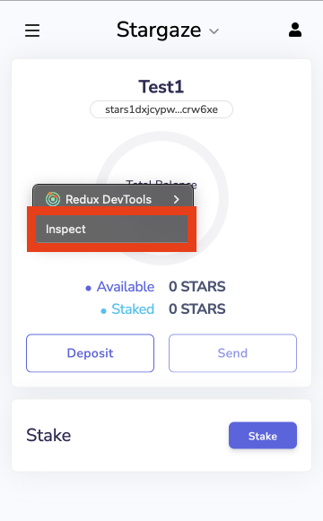
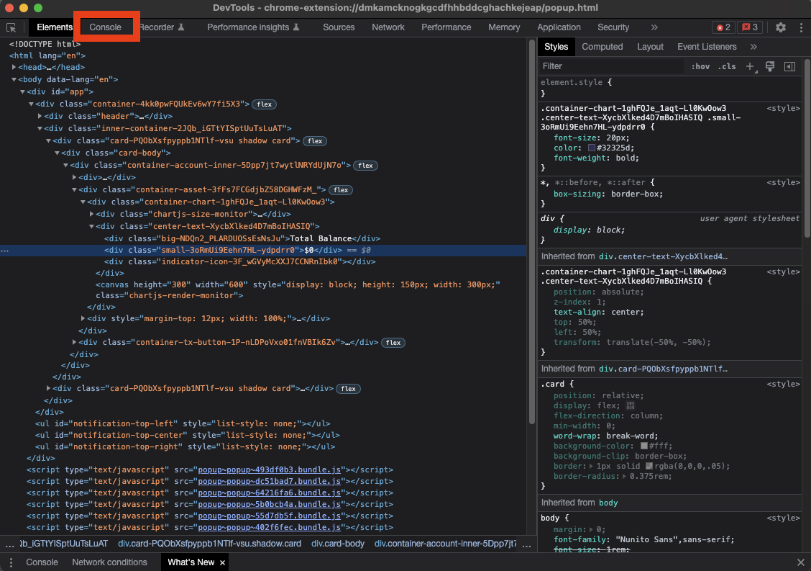
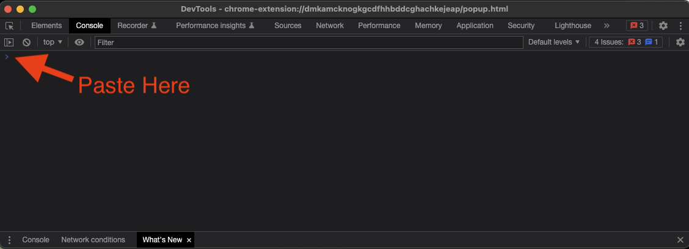
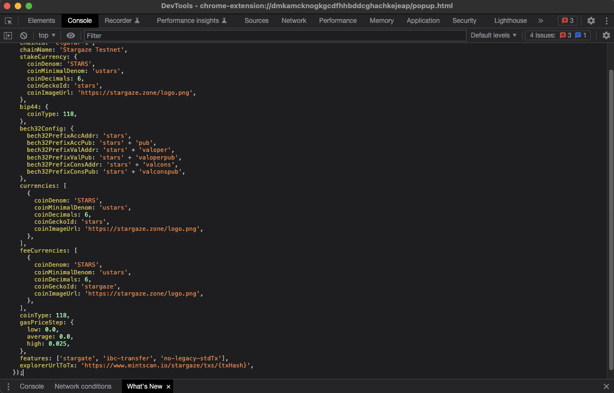
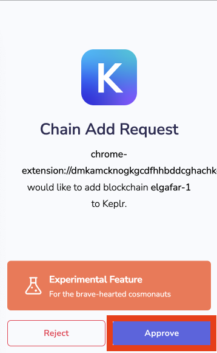
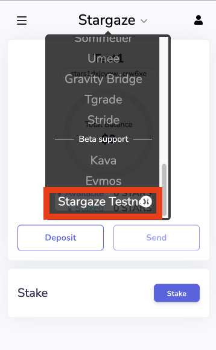
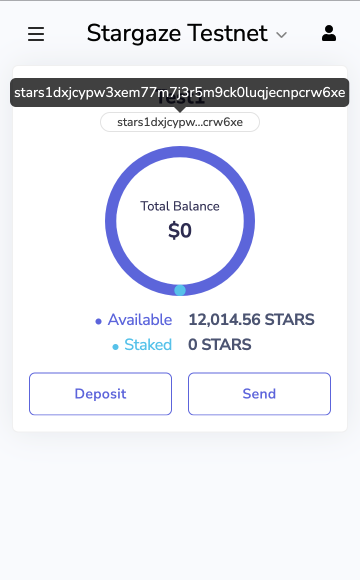

# How to add Stargaze Testnet to wallets

You can follow these steps in Google Chrome, Brave browser, or any other browser which supports wallet extension(Keplr, Cosmostation, Leap, etc). 


## Keplr
> download link: https://www.keplr.app/download

<p align="center">
  
</p>


### 1) Open Keplr wallet, right-click on it, and click on ``Inspect``.

This will open ``DevTools`` window.



### 2) On the ``DevTools`` window, click on the ``Console`` tab.



### 3) Copy the following code.

```js
window.keplr.experimentalSuggestChain({
  chainId: 'elgafar-1',
  chainName: 'Stargaze Testnet',
  rpc: 'https://rpc.elgafar-1.stargaze-apis.com/',
  rest: 'https://rest.elgafar-1.stargaze-apis.com/',
  bip44: {
    coinType: 118,
  },
  bech32Config: {
    bech32PrefixAccAddr: 'stars',
    bech32PrefixAccPub: 'stars' + 'pub',
    bech32PrefixValAddr: 'stars' + 'valoper',
    bech32PrefixValPub: 'stars' + 'valoperpub',
    bech32PrefixConsAddr: 'stars' + 'valcons',
    bech32PrefixConsPub: 'stars' + 'valconspub',
  },
  currencies: [
    {
      coinDenom: 'STARS',
      coinMinimalDenom: 'ustars',
      coinDecimals: 6,
      coinGeckoId: 'stars',
      coinImageUrl: 'https://stargaze.zone/logo.png',
    },
  ],
  feeCurrencies: [
    {
      coinDenom: 'STARS',
      coinMinimalDenom: 'ustars',
      coinDecimals: 6,
      coinGeckoId: 'stargaze',
      coinImageUrl: 'https://stargaze.zone/logo.png',
      gasPriceStep: {
        low: 0.0,
        average: 0.0,
        high: 0.025,
      },
    },
  ],
  stakeCurrency: {
    coinDenom: 'STARS',
    coinMinimalDenom: 'ustars',
    coinDecimals: 6,
    coinGeckoId: 'stars',
    coinImageUrl: 'https://stargaze.zone/logo.png',
  },
  coinType: 118,
  features: ['ibc-transfer'],
  explorerUrlToTx: 'https://www.mintscan.io/stargaze/txs/{txHash}',
});
```

### 4) Paste the code in the ``Console`` tab.



### 5) Press ``Enter``.



### 6) Click ``Approve`` button on Keplr Wallet window.



### 7) Close Keplr Wallet and re-open it.

### 8) Click on the networks present at top of Keplr Wallet, scroll down, and select ``Stargaze Testnet``.



### 9) The wallet is ready and you can copy the address.




## Cosmostation

> download link: https://www.cosmostation.io/wallet/#extension

<p align="center">
  
</p>

### 1) Open Cosmostation wallet, right-click on it, and click on ``Inspect``.

This will open ``DevTools`` window.


### 2) On the ``DevTools`` window, click on the ``Console`` tab.


### 3) Copy the following code.

```js
window.cosmostation.cosmos.request({
  method: "cos_addChain",
  params: {
    chainId: 'elgafar-1',
    chainName: 'Stargaze Testnet',
    addressPrefix: 'stars',
    baseDenom: 'ustars',
    displayDenom: 'STARS',
    restURL: 'https://rest.elgafar-1.stargaze-apis.com/',
    coinType: '118',
    decimals: 6,
    gasRate: {
      low: '0.0',
      average: '0.0',
      tiny: '0.025',
    },
  },
});
```

### 4) Paste the code in the ``Console`` tab.


### 5) Press ``Enter``.


### 6) Click ``Confirm`` button on Cosmostation Wallet window.


### 7) Close Cosmostation Wallet and re-open it.

### 8) Click on the networks present at top of Cosmostation Wallet,and select ``Stargaze Testnet``.


### 9) The wallet is ready and you can copy the address.


## Leap

> download link: https://www.leapwallet.io/

<p align="center">
  
</p>

### 1) Click the hamburger button.


### 2) Click the `Network` menu under the Preferences category.


### 3) Click the `Testnet` option.


### 4) The wallet is ready for testnet and you can copy the address.


# How to get $STARS on Stargaze Testnet

1. Visit the faucet channel on the Stargaze discord

- https://discord.com/channels/755548171941445642/940653213022031912

2. Copy your stargaze address from your wallet
3. Send a request in the #faucet channel with a following command:

- `$request YOUR_STARS_ADDRESS`


4. The bot will reply with the transaction info
